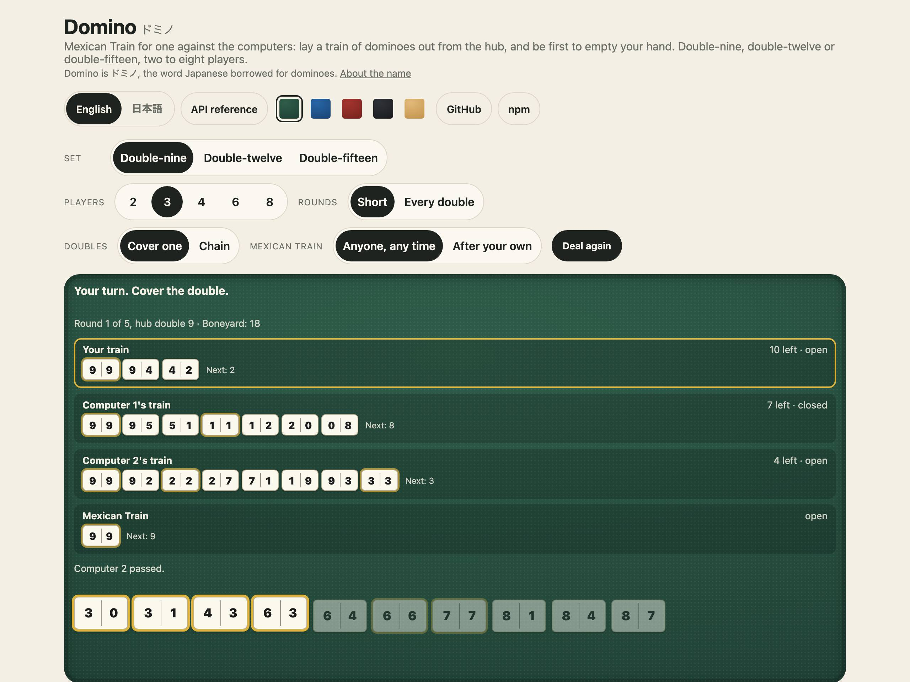
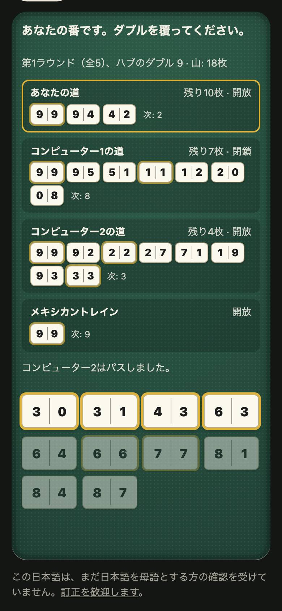

<h1 align="center">Domino <sub>ドミノ</sub></h1>

<p align="center"><strong>Dominoes and Mexican Train for JavaScript and TypeScript.</strong><br>
Double-nine, double-twelve and double-fifteen sets; the full rules of Mexican Train for two to eight players; a computer player; seeded deals that replay exactly; and a saved game small enough to keep in a column; the words of the table in English and Japanese; tile sounds; and a command line. No dependencies.</p>

<p align="center">
  <a href="https://github.com/johnmorrisdotca/domino/actions/workflows/ci.yml"></a>
  <a href="https://www.npmjs.com/package/@johnmorrisdotca/domino"></a>
  <a href="./LICENSE"></a>
  
</p>

<p align="center"><a href="https://johnmorrisdotca.github.io/domino/"><strong>Play Mexican Train →</strong></a> · <a href="https://johnmorrisdotca.github.io/domino/api.html">API reference</a></p>

<p align="center">
  
  
</p>

## In 30 seconds

```sh
npm install @johnmorrisdotca/domino
```

```ts
import { computerMove, encodeTrain, legalPlays, playTrain, startTrain } from "@johnmorrisdotca/domino";

// A double-twelve table for four, a computer in every seat but the first, dealt from seed 2026.
let game = startTrain(12, ["You", "", "", ""], 2026, undefined, [false, true, true, true])!;

legalPlays(game);                        // every tile you may lay, and on which train
game = playTrain(game, computerMove(game))!;   // a move: a new game, or null for one the rules refuse
encodeTrain(game);                       // the whole game as a short text, to keep and read back
```

Or from a terminal, with nothing to install:

```sh
npx @johnmorrisdotca/domino play --seed 2026 --players 3 --set 9 --length short
```

## Who it is for

- **Game sites and apps** that want a domino table with the rules already right,
  a computer for any empty seat, and games that can be saved and resumed.
- **Anyone writing a domino game of their own**, who wants the set, the tiles
  and their ends as plain numbers and pure functions to build on.
- **People who want to look at a game**: the command line deals a seed, plays
  one out and reads a kept game back, in English or Japanese.

## Use it in your project

Domino has no screen of its own: it is plain functions over plain data, so
every framework uses it the same way. Keep the game in your state, show it
however you like, and pass each move through `playTrain`. The table in the
[demo](https://johnmorrisdotca.github.io/domino/) is
[`demo/page.js`](./demo/page.js), a page of plain DOM that does exactly that,
and the demo's *Using it* panel shows the code for the game on the table.

### 1. The API alone

```ts
import { computerMove, decodeTrain, encodeTrain, legalPlays, mexicanOf, playTrain, startTrain, trainStatus } from "@johnmorrisdotca/domino";

let game = startTrain(9, ["Ann", "Ben", ""], 7, { length: "short", doubles: "chain", mexican: "ownFirst" }, [false, false, true])!;

legalPlays(game);                         // [{ tile, train }, …]: every lay now, a tile being a number
playTrain(game, { kind: "draw" });        // null: the rules refuse a draw while a tile fits
trainStatus(game, "en", 0);               // "Your turn. Tap a tile to lay it." (seat 0 is you)

const kept = encodeTrain(game);           // text: the table, the seed and the moves
decodeTrain(kept);                        // the same game, played again through the rules, or null
mexicanOf(game);                          // 3: the Mexican Train is numbered after the seats
```

### 2. A plain page

```html
<script type="module">
  import { startTrain, tileWords } from "./node_modules/@johnmorrisdotca/domino/dist/index.js";

  const game = startTrain(12, ["You", "", ""], 2026, undefined, [false, true, true]);
  document.body.textContent = game.hands[0].map(tileWords).join("  ");
</script>
```

No bundler is needed: `dist/index.js` is an ES module that imports nothing
outside the package, so a `<script type="module">` reads it as it is, from
wherever you serve it.

### 3. On a server

A game is its table, its seed and its moves, so a server keeps one short text
per game and plays it again through the rules whenever it needs the state.
`decodeTrain` trusts nothing it reads: a changed or invented save comes back
`null`, so a client can send moves and the server can check every one.

### 4. From a terminal

See [The command line](#the-command-line).

There is no React, Vue, Svelte or Angular component, on purpose: a table is a
screen, and every site draws its own. Domino gives it the rules, the words and
the sounds.

## Features

- **The full rules of Mexican Train**, for two to eight players on a
  double-nine, double-twelve or double-fifteen set, with the house rules as
  options.
- **A computer player** that plans its longest run, plays doubles well and
  answers in a few milliseconds.
- **Seeded deals that replay exactly.** The same seed and table deal the same
  hands on every machine, and a game is only its table, its seed and its moves.
- **Saved games as text**, read back through the rules, so a changed save is
  refused.
- **The words of a table** in English and Japanese: whose turn it is, what was
  laid, how a round ended. See [Languages](#languages).
- **Tile sounds**, optional: tiles laid, drawn and shuffled, and a knock for a
  pass. See [Sounds](#sounds).
- **A command line**: deal a seed, play a game out, read a kept game back. See
  [The command line](#the-command-line).
- **No dependencies, and no drawing.** Plain functions over plain data.

## Mexican Train

A hub double in the middle, a train out of it for every player, and one more,
the Mexican Train, that anybody may add to. Rounds count down from the set's
highest double, the hub, to the blank; whoever goes out first ends the round, and
the fewest pips over the whole game wins.

- **Sets**: double-nine (55 tiles), double-twelve (91, the usual one) and
  double-fifteen (136), with the hand size for each set and number of players.
- **House rules**, as options: `length` (`full`, every round, or `short`),
  `doubles` (`one`: a double laid must be covered next, or `chain`), and
  `mexican` (`any`: anyone may start the Mexican Train, or `ownFirst`).
- **Trains open and close**: a player who cannot lay draws, and if still stuck
  marks their train open for everyone until they next lay on it.
- **A blocked round** ends when nobody can lay and nothing is left to draw.
- **A computer player** (`computerMove`) that lays its longest run on its own
  train and plays doubles well, in a few milliseconds.
- **Saved games**: `encodeTrain` and `decodeTrain` write and read a game as
  text, and reading trusts nothing: every move is played again through the
  rules, and a changed save is refused.

A tile is a number, `a × 16 + b` with `a ≤ b` (`TRAIN_PIP_BASE`), so a hand is
an array of numbers and a game is plain data that can be stored or sent as it is.

## Saved games

A kept game is JSON: the version, the set, the options, the seed, the names,
which seats are computers, and the moves. A move is a few characters:
`p<tile>.<train>` for a tile laid (the tile as its number, the train by seat,
the Mexican Train last), `d` for a draw, `x` for a pass and `n` for the next
round dealt. The game in *In 30 seconds*, after its one move, is:

```json
{"v":1,"set":12,"options":{"length":"full","doubles":"one","mexican":"any"},"seed":2026,"players":["You","","",""],"computers":[false,true,true,true],"moves":"p156.0"}
```

Nothing else is kept: hands, trains and the boneyard are made again from the
seed (`replayTrain`), so what is read back is exactly the game those moves make,
or nothing at all. Every game in `src/mexicanTrain/train.fixture.json` was kept by
people on itsutsu.com before the move to this package, and is dealt and played
again exactly by the tests.

## The command line

```sh
npm install -g @johnmorrisdotca/domino    # then `domino`, or use npx with nothing installed
```

```
Usage: domino <command> [options]

Dominoes and Mexican Train: the same deal for the same seed, on every machine.

  domino deal --seed 2026 --players 4      the deal a seed makes: every hand, and the hub double
  domino play --seed 2026 --players 4      a game played out by computers, with its scores
  domino play --seed 2026 --moves          ...and every move, in words
  domino play --seed 2026 --save           ...and the saved game, as text
  domino check "<saved game>"              read a saved game back through the rules, and say where it stands
  domino replay "<saved game>"             every move of a saved game, in words

Options:
      --set <9|12|15>        the set, by its highest double (12 unless said)
      --players <2..8>       how many sit at the table (4 unless said)
  -s, --seed <n>             a whole number (one is drawn, and named on standard error, unless given)
      --length <full|short>  every round, or half of them (full unless said)
      --doubles <one|chain>  cover each double at once, or chain doubles (one unless said)
      --mexican <any|own-first>
                             the Mexican Train open to all, or only once you have laid on your own
      --moves                play: print every move
      --save                 play: print the saved game on the last line
      --stdin                check, replay: read the saved game from standard input
  -j, --json                 print JSON (format 1) for deal, play and check
      --lang <en|ja>         English or Japanese (default: your system's)
  -h, --help                 this help
  -v, --version              the version

Exit codes: 0 done, 1 what was asked for could not be done (a saved game the
rules refuse), 2 the command was wrong.
```

```sh
$ domino deal --seed 2026 --players 3 --set 9
Double-nine, 3 players, seed 2026
Round 1 of 10, hub double 9
Computer 1: 3-0 4-2 4-3 6-3 6-6 7-7 8-4 8-7 9-4 9-5
Computer 2: 1-1 2-0 2-1 5-0 5-1 7-3 7-4 8-0 8-2 8-6
Computer 3: 0-0 2-2 3-3 5-4 7-1 7-2 7-5 9-1 9-2 9-3
Boneyard: 24 tiles
$ domino play --seed 2026 --players 3 --set 9 --length short
Double-nine, 3 players, seed 2026, 5 rounds; moves made: 277
Hub    Computer 1  Computer 2  Computer 3
9              23          51          0*
8              11          0*          16
7              0*          58          27
6              54          0*           0
5              0*           8          14
Total          88         117          57

Winner: Computer 3 with 57 pips.
```

In the table of scores a `*` marks the seat that played out. The language
follows `--lang`, then `LC_ALL`, `LC_MESSAGES` and `LANG`, then the system's.
A seed that is not given is drawn and named on standard error, so the run can
be repeated. The command line is run as a child process on Linux, macOS and
Windows in CI.

From code, the whole command line is one pure function:

```ts
import { runCli } from "@johnmorrisdotca/domino";

runCli(["deal", "--seed", "2026", "--players", "3", "--set", "9"]);   // { code: 0, out: "Double-nine, 3 players, …", err: "" }
```

## Languages

The words of a table are English and Japanese: `DOMINO_STRINGS.en` and
`DOMINO_STRINGS.ja`, one table, so the two are kept side by side. Five functions
say what the rules have already decided, in either language:

```ts
import { trainNews, trainSeatName, trainStatus } from "@johnmorrisdotca/domino";

trainStatus(game, "ja", 0);        // "あなたの番です。牌をタップして置きます。"
trainNews(game, "en", 0);          // "You laid 12–9 on Your train."  (after the first move)
trainSeatName(game, 1, "en", 0);   // "Computer 2"
```

`dominoSay` fills in the braces (`{who}`, `{tile}`) of any string, and
`dominoLanguage` reads a tag such as `ja_JP.UTF-8`. **Japanese: included; not yet
reviewed by a native reader. Corrections welcome.** Every Japanese string is
listed beside its English in [docs/strings-ja.md](./docs/strings-ja.md), and there
is an [issue template](https://github.com/johnmorrisdotca/domino/issues/new?template=fix-a-translation.md)
for fixing one. Any other language is a table of your own with the same names.

## Sounds

Recordings for a table to play: the tiles shuffled, one drawn, one laid, and a
knock on the table for a pass. Nothing sounds unless a table asks, and nothing is
fetched until the first sound.

```ts
import { createTileSounds } from "@johnmorrisdotca/domino/tile-sounds";

const sounds = createTileSounds();           // silent until asked: nothing is fetched yet
sounds.play("shuffle");
sounds.play("draw", { count: 7, gap: 120 });  // seven tiles drawn, one after another
sounds.play("lay");                          // a tile laid on a train
sounds.play("knock");                        // a pass
muteButton.onclick = () => sounds.setMuted(!sounds.muted);
```

| Kind | What it is |
| --- | --- |
| `shuffle` | the tiles stirred face down |
| `draw` | a tile taken from the boneyard; `{ count }` takes several, one every `gap` milliseconds |
| `lay` | a tile set down on a train |
| `knock` | a rap on the table: a pass |

- **What they really are.** The recordings are poker chips, from Kenney's
  [Casino Audio](https://kenney.nl/assets/casino-audio) (CC0), because that is the
  nearest recorded click of a hard tile on a table that is free to use. They are
  not dominoes, and [docs/credits.md](./docs/credits.md) says so, names each file
  and what was done to it.
- **What it costs.** The player is small, and the recordings are a few tens of
  kilobytes of AAC in a module of their own (`@johnmorrisdotca/domino/sounds`),
  fetched by the first sound and never before: a muted table never downloads them.
- **A browser only lets a page make sound after somebody has touched it**, so a
  sound asked for by code before any tap is silent.
- If the recordings cannot be fetched or decoded, a short sound made in the
  browser stands in. Nothing throws where there is no audio, as on a server.
- Options of `createTileSounds`: `muted` (start muted), `volume` (0 to 1; 0.6
  unless said), `load` (where the recordings come from) and `window` (the window
  to make sound in, or `null` for silence). The demo's table has a **Sound**
  switch, off until pressed.

## API

The [API reference](https://johnmorrisdotca.github.io/domino/api.html) (also kept in the repository as [`docs/api.md`](https://github.com/johnmorrisdotca/domino/blob/main/docs/api.md)) lists every export of every entry point with its signature and its doc comment. It is made from the source by `pnpm docs:api`, and a test fails when it falls behind the code.

| Export | What it does |
| --- | --- |
| `startTrain(set, players, seed?, options?, computers?)` | A new game, or null for a table the rules do not allow |
| `playTrain(game, move)` | The game after a move, or null for a move the rules refuse |
| `trainMoves`, `legalPlays`, `mayLay`, `openEnd`, `mexicanOf` | What may be played, and where |
| `computerMove(game)`, `longestRun(hand, end)` | The computer's move, and the run it plans |
| `encodeTrain`, `decodeTrain`, `replayTrain`, `movesOf`, `moveCount` | Saving a game, reading it back, and replaying its moves |
| `trainTotals`, `handPips`, `trainAgain`, `trainPlayerName`, `peopleAt`, `cleanTrainName` | Scores, a fresh deal at the same table, and the seats |
| `tileOf`, `endsOf`, `isDouble`, `pipsOf`, `fits`, `laidAgainst`, `laidEnds`, `tileOfLaid`, `everyTile`, `tileWords` | Tiles as numbers: making, reading and laying them |
| `TRAIN_SETS`, `TRAIN_SET_NAMES`, `trainSetName`, `handSizeFor`, `roundsFor`, `TRAIN_DEFAULT_OPTIONS`, `TRAIN_LENGTHS`, `TRAIN_DOUBLES`, `TRAIN_MEXICAN`, `TRAIN_PHASES`, `TRAIN_PIP_BASE`, `TRAIN_NAME_MOST` | The vocabulary and the limits |
| `seededRandom(seed)`, `shuffled(items, random)` | The seeded stream every deal is made from |
| `DOMINO_STRINGS`, `dominoSay`, `dominoLanguage` | The words of a table, English and Japanese |
| `trainStatus`, `trainNews`, `trainSeatName`, `trainName`, `trainSetLabel` | What is going on, what just happened, and who is who, in words |
| `runCli`, `cliLanguage`, `CLI_MOVES_MOST` | The command line as a pure function |
| `createTileSounds`, `TILE_SOUND_KINDS`, `soundTimes`, `MOST_SOUNDS_AT_ONCE` (`/tile-sounds`) | The tile sounds |
| `TILE_SOUND_DATA` (`/sounds`) | The recordings, as base64 AAC |
| `TrainGame`, `TrainMove`, `TrainOptions`, `Domino`, `Language`, … | The types |
| `VERSION` | This package's version |

## Theming

None, on purpose: Domino draws nothing, so there is nothing of its own to
theme, and a table built on it looks however your page looks. The demo is the
worked example: its dominoes and table are drawn by [`demo/page.js`](./demo/page.js)
and [`demo/domino.css`](./demo/domino.css), over the family's shared stylesheet.

## Limits

| Limit | Value | Constant |
| --- | --- | --- |
| Players at a table | 2 to 8 | |
| Sets | double-nine (55 tiles), double-twelve (91), double-fifteen (136) | `TRAIN_SETS` |
| Tiles in a hand | 6 to 15, by the set and the players | `handSizeFor` |
| Rounds | one for every double (10, 13 or 16), or about half of them (5, 7 or 8) | `roundsFor` |
| A seat's name | 20 characters | `TRAIN_NAME_MOST` |
| A seed | a whole number, read modulo 4,294,967,296; the command line takes 0 to 4,294,967,295 | |
| A tile | `low * 16 + high`, each end 0 to 15 | `TRAIN_PIP_BASE` |
| Moves a played game may take on the command line | 100,000 | `CLI_MOVES_MOST` |

## Browser and runtime support

The rules, the computer player, the words and the command line run anywhere
JavaScript does: every current browser, Node, Deno and Bun. It needs ES2020. The
package declares Node 22 and later (`engines`), and CI runs it on Node 22 and 24
and, for the packed package and the command line, on Linux, macOS and Windows.
The sounds need the Web Audio API, which every current browser has; elsewhere
they are silent and nothing throws. The demo is tested in Chromium and in
WebKit, Safari's engine, at phone size with touch.

## Architecture

The dominoes and the rules of Mexican Train are plain functions over plain
data with no DOM and no dependency: a game is a value, every move returns the
next one, and a seed replays a deal exactly. The computer player and the
saved-game format are separate modules over the same rules, and every game so
far lives in a folder of its own, so the next one is a sibling of
`mexicanTrain/`.

```text
src/
├── index.ts        the main entry: the dominoes, Mexican Train's rules, its computer player, its saved-game format, its words and its command line
├── cli.ts          the command line, as a pure function
├── random.ts       seeded randomness, the one thing every deal is made from
├── sounds.ts       the recordings of the tile sounds, as base64 (written by scripts/sounds.mjs)
├── strings.ts      every word Domino says, in English and Japanese
├── tile-sounds.ts  the tile sounds: a player that fetches the recordings on the first sound
├── version.ts      the package's version
├── words.ts        what a table says: who is who, what just happened, whose turn it is
└── mexicanTrain/   Mexican Train, the one game so far
    ├── dominoes.ts                the dominoes themselves: the double-nine, double-twelve and double-fifteen sets, their ends and pips, and which fit
    ├── mexicanTrain.constants.ts  the numbers the game is played by: set sizes, train lengths and the doubles rules
    ├── mexicanTrain.ts            the rules of Mexican Train: deal, trains, doubles, drawing and scoring
    ├── mexicanTrain.types.ts      the game, its moves and its options, as the rules speak of them
    ├── trainCodec.ts              a game as text and back: its options, its seed and every move
    └── trainComputer.ts           the computer player
```

Tests sit beside the code they test (`*.test.ts`), and `src/docs.test.js` holds
this README's examples and tables to the code. `bin/` is the command line's few
lines. `scripts/` checks the package as npm packs it (`pnpm test:package`), runs
the command line as a child process (`pnpm test:cli`), makes the API reference,
`docs/api.md`, cuts the sounds, and builds the demo (`pnpm site`) and tests it in
a real browser (`pnpm test:demo`); `demo/` is the page published on GitHub Pages.

## The name

*Domino* is ドミノ (domino), the word Japanese uses for dominoes, borrowed from
the European game as English borrowed it.

## Where it comes from, and where it is used

Domino was written for [itsutsu.com](https://itsutsu.com), a site of games
played with friends and family, where Mexican Train is played at one device or
several. Every deal and every computer game there before the move is held by
this package's tests, so a game kept on the site replays exactly.

Using it somewhere? [Tell us](https://github.com/johnmorrisdotca/domino/issues/new?template=add-my-project.md).

### The family

<!-- family:start (made by scripts/family-readme.mjs from scripts/family-template.mjs; change those, not this) -->
Domino is one of twenty-four packages, each made for the same site, each at
[github.com/johnmorrisdotca](https://github.com/johnmorrisdotca). The code of every one is MIT.

- [Korokoro](https://github.com/johnmorrisdotca/korokoro) (コロコロ): dice, with notation, exact odds, real sounds and the dice of many games. [Demo](https://johnmorrisdotca.github.io/korokoro/).
- [Kyuubu](https://github.com/johnmorrisdotca/kyuubu) (キューブ): a turning cube for the browser, 2×2 to 7×7, with record solves to replay. [Demo](https://johnmorrisdotca.github.io/kyuubu/).
- [Hitotsu](https://github.com/johnmorrisdotca/hitotsu) (一つ): a colour-card shedding game for two to eight, with the house rules people play. [Demo](https://johnmorrisdotca.github.io/hitotsu/).
- [Toranpu](https://github.com/johnmorrisdotca/toranpu) (トランプ): a deck of playing cards, card games with computer players, and solitaires. [Demo](https://johnmorrisdotca.github.io/toranpu/).
- [Tane](https://github.com/johnmorrisdotca/tane) (種): seeded random numbers and daily seeds, the same in every browser and on every server. [Demo](https://johnmorrisdotca.github.io/tane/).
- [Narabe](https://github.com/johnmorrisdotca/narabe) (並べ): one rules engine for abstract board games, from gomoku and Reversi to Go and checkers. [Demo](https://johnmorrisdotca.github.io/narabe/).
- [Tenka](https://github.com/johnmorrisdotca/tenka) (天下): world conquest for two to six, on a map of the real world. [Demo](https://johnmorrisdotca.github.io/tenka/).
- [Kumimoji](https://github.com/johnmorrisdotca/kumimoji) (組み文字): a crossword tile race, in English and Japanese kana. [Demo](https://johnmorrisdotca.github.io/kumimoji/).
- [Tsunagi](https://github.com/johnmorrisdotca/tsunagi) (繋ぎ): a line-joining logic puzzle whose every level has exactly one answer. [Demo](https://johnmorrisdotca.github.io/tsunagi/).
- [Jarajara](https://github.com/johnmorrisdotca/jarajara) (ジャラジャラ): mahjong tiles drawn as SVG, stacked layouts, and the matching solitaire Awase. [Demo](https://johnmorrisdotca.github.io/jarajara/).
- [Suido](https://github.com/johnmorrisdotca/suido) (水道): a pipe puzzle: turn the pieces until the water reaches every drain. [Demo](https://johnmorrisdotca.github.io/suido/).
- [Domino](https://github.com/johnmorrisdotca/domino) (ドミノ): dominoes and Mexican Train. [Demo](https://johnmorrisdotca.github.io/domino/).
- [Kotoba](https://github.com/johnmorrisdotca/kotoba) (言葉): word lists and word-game rules in English, French, German and Japanese. [Demo](https://johnmorrisdotca.github.io/kotoba/).
- [Sugoroku](https://github.com/johnmorrisdotca/sugoroku) (双六): backgammon and its variants, with the doubling cube and match play. [Demo](https://johnmorrisdotca.github.io/sugoroku/).
- [Kazu](https://github.com/johnmorrisdotca/kazu) (数): grid number puzzles: Sudoku and its variants, Futoshiki and Skyscrapers. [Demo](https://johnmorrisdotca.github.io/kazu/).
- [Meikyuu](https://github.com/johnmorrisdotca/meikyuu) (迷宮): mazes on squares, hexagons, triangles and circles, made from a seed and drawn through with a finger or the mouse. [Demo](https://johnmorrisdotca.github.io/meikyuu/).
- [Hikidashi](https://github.com/johnmorrisdotca/hikidashi) (引き出し): a drawer of small Japanese text tools: era dates, kanji numerals, readings and sentence difficulty. [Demo](https://johnmorrisdotca.github.io/hikidashi/).
- [Chizu](https://github.com/johnmorrisdotca/chizu) (地図): maps of the world and of countries' regions, in English and Japanese, with a quiz and callouts. [Demo](https://johnmorrisdotca.github.io/chizu/).
- [Bushu](https://github.com/johnmorrisdotca/bushu) (部首): find a kanji by the parts it is made of. [Demo](https://johnmorrisdotca.github.io/bushu/).
- [Tobiishi](https://github.com/johnmorrisdotca/tobiishi) (飛び石): peg solitaire with nine boards and seeded solvable challenges. [Demo](https://johnmorrisdotca.github.io/tobiishi/).
- [Jirai](https://github.com/johnmorrisdotca/jirai) (地雷): minesweeper on shaped grids with verified no-guess boards. [Demo](https://johnmorrisdotca.github.io/jirai/).
- [Gunjin](https://github.com/johnmorrisdotca/gunjin) (軍人): five hidden-rank strategy games with pass-the-device play. [Demo](https://johnmorrisdotca.github.io/gunjin/).
- [Karakuri](https://github.com/johnmorrisdotca/karakuri) (からくり): eight hyper-casual puzzle games, some of them physics: draw a shield, pull pins, cut ropes, slide blocks, pour tubes. [Demo](https://johnmorrisdotca.github.io/karakuri/).
- [Houseki](https://github.com/johnmorrisdotca/houseki) (宝石): gem and stone matching puzzles: falling triplets, stone collapse, colour chains and gem swap. [Demo](https://johnmorrisdotca.github.io/houseki/).

**This package is Domino.** The demos of all twenty-four share one header and footer, so each links the rest.
<!-- family:end -->

## Roadmap

- More domino games: Block, Draw, All Fives and Chicken Foot
- A React hook, for a table kept in component state

Left out on purpose: anything played for stakes, and play over a network, which
needs a server. A game here is plain data, so your own server can carry it.

## Contributing

See [CONTRIBUTING.md](./CONTRIBUTING.md). In short:

```sh
pnpm install
pnpm check         # lint, types and tests
pnpm test:cli      # the command line, run as a child process
pnpm test:package  # pack it as npm does, install it, import every entry and run the command
pnpm test:demo     # the demo in real browsers, by taps
```

A change to the rules must leave every game in the fixture dealing and playing
exactly as it did. Please follow the [code of conduct](./CODE_OF_CONDUCT.md).

## Changes

See [CHANGELOG.md](./CHANGELOG.md).

## Licence

[MIT](./LICENSE) © John Morris. The tile sounds are Kenney's Casino Audio, CC0:
see [docs/credits.md](./docs/credits.md).
